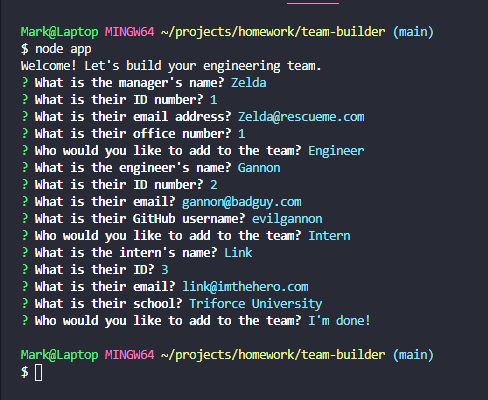
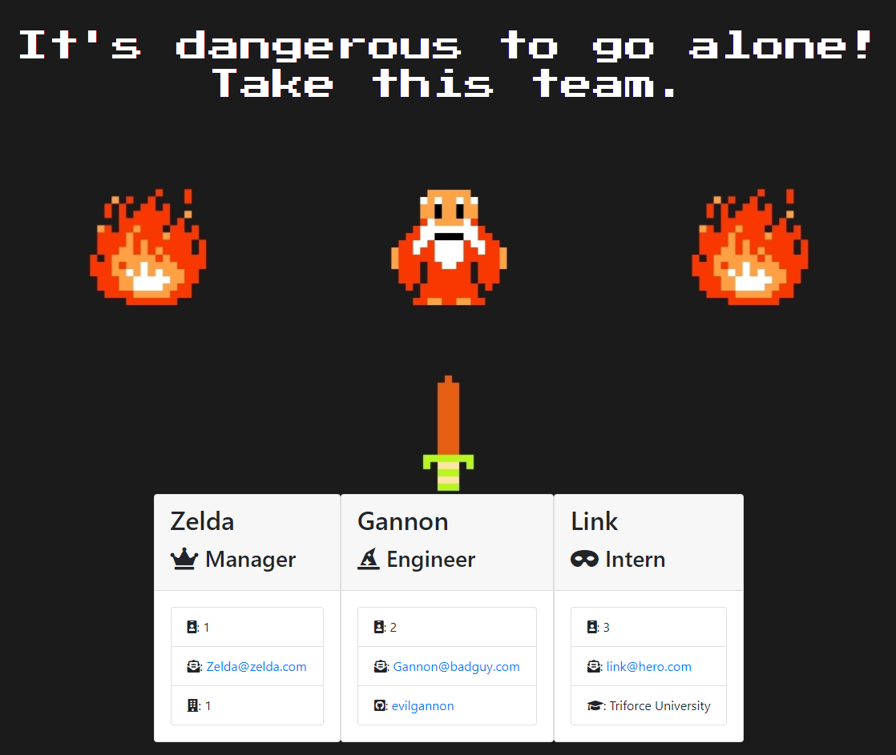

[](https://img.shields.io/github/license/markdcross/team-builder)

# Team Roster Generator

## Description

A software engineering team generator CLI with a twist. The application prompts the user for information about the team manager and then information about each team member. The user can input any number and combination of team members (a mix of engineers and interns). When the user has completed building the team, the application will create an HTML file that displays a team roster based on the information provided.

```
As a manager
I want to generate a webpage that displays my team's basic info
so that I have quick access to emails and github profiles
```

## Table of Contents

1. [Installation](#Installation)
2. [Usage](#Usage)
3. [License](#License)
4. [Contributing](#Contributing)
5. [Tests](#Tests)
6. [Questions](#Questions)

## Installation

1. Clone the repository `git clone https://github.com/jallan07/dugout-team-roster-generator.git`
2. Install dependencies `npm i`

## Usage

[Usage video](https://drive.google.com/file/d/1z-M7Gwj19qR_hRslqVB_WobjmDdNONF1/view)





Run with `npm app.js`. Using the [Inquirer npm package](https://github.com/SBoudrias/Inquirer.js/), respond to prompts to provide a complete set of information. Once finished, the HTML document can be found in the output directory

## License

Licensed under the [MIT](https://github.com/markdcross/team-builder/blob/master/LICENSE.txt) license.

## Contributing

[](code_of_conduct.md)

#### [Contributor Covenant Code of Conduct](https://www.contributor-covenant.org/version/2/0/code_of_conduct/)

## Tests

Tests written with Jest. To run tests, use `npm run test`

## Questions

Feel free to contact me with any questions or feedback:

-   GitHub: [markdcross](https://github.com/markdcross)
-   Email: <markdcross@gmail.com>
